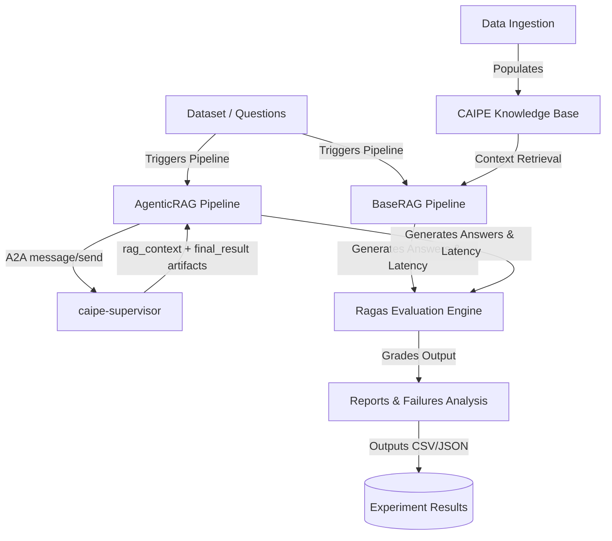
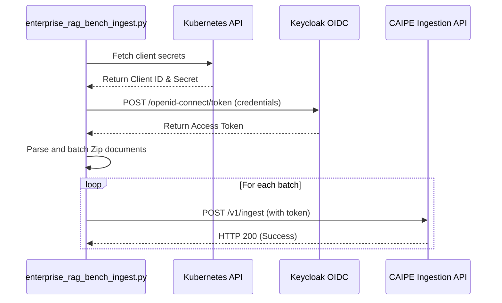
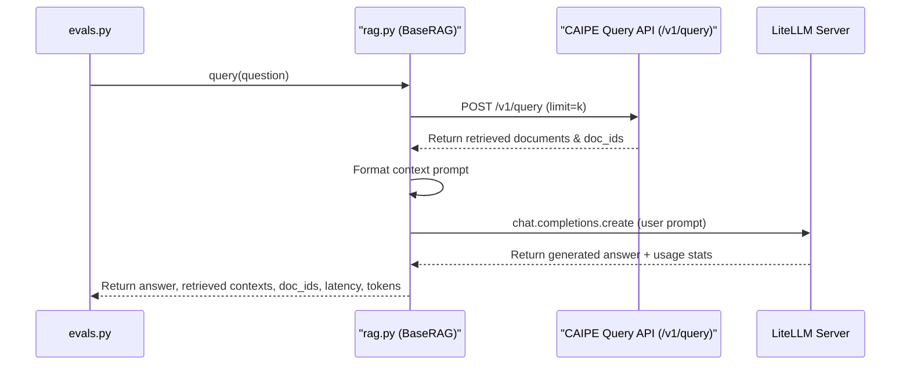
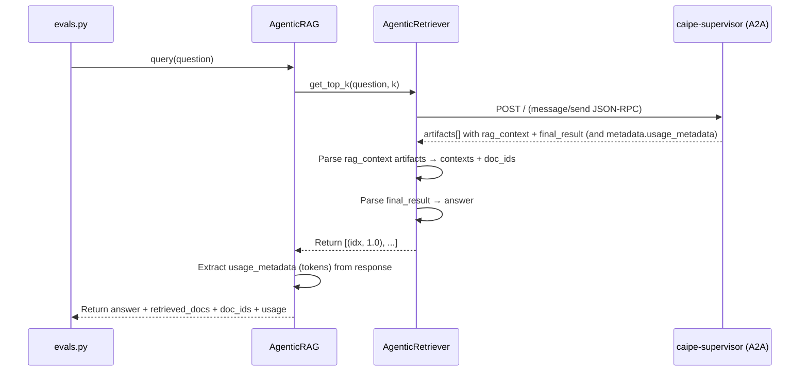
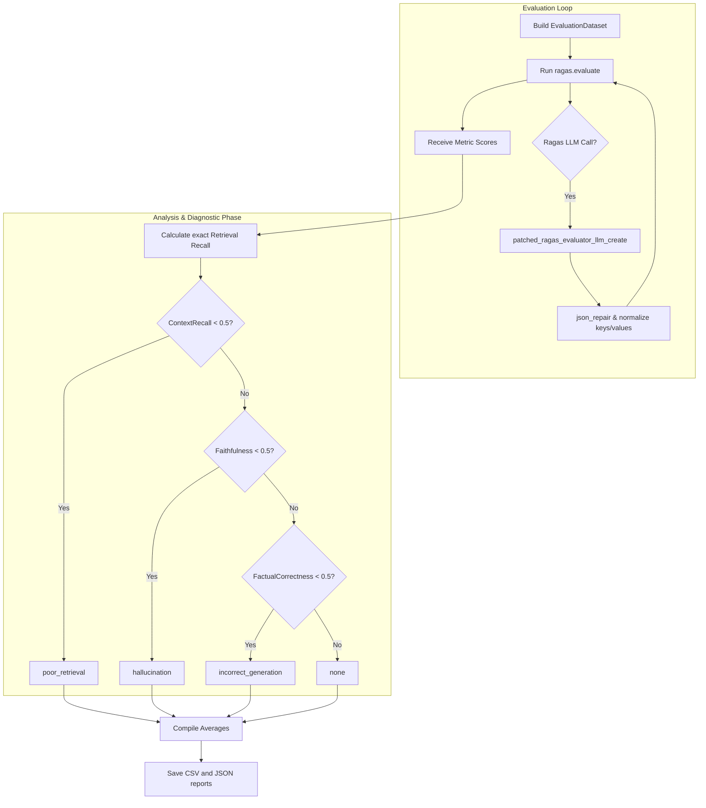

# RAG Evaluation System: Design and Data Flow Documentation

This document explains the architecture, execution pipeline, and data flow of the RAG (Retrieval-Augmented Generation) Evaluation system.

---

## 1. Architecture Overview

The system consists of three main components:
1. **Knowledge Ingestion Pipeline**: Ingests test corpus documents (such as Confluence, Jira, and Slack datasets) into a CAIPE RAG Knowledge Base.
2. **RAG Client Pipeline**: Connects to the CAIPE knowledge base to retrieve context and generates answers using a configured LLM.
3. **Ragas Evaluation & Analysis Engine**: Orchestrates execution across test datasets, runs evaluations using multi-dimensional Ragas metrics, and provides operational and failure cause analysis.

---

## 2. Component Design & Code Structure

* **Configuration Management ([config.py](../src/ragas_eval/config.py))**: Consolidates settings such as LLM models, endpoints, datasource IDs, retrieval limits, and evaluation parameters using Pydantic Settings.
* **Document Ingestion ([enterprise_rag_bench_ingest.py](../src/ragas_eval/enterprise_rag_bench_ingest.py))**: Downloads dataset files, obtains OIDC tokens, and uploads batches to CAIPE.
* **RAG Pipeline Implementation ([rag.py](../src/ragas_eval/rag.py))**: Core RAG system implementing:
  * [CaipeRetriever](../src/ragas_eval/rag.py): Queries CAIPE Knowledge Base using OIDC authentication.
  * [SimpleKeywordRetriever](../src/ragas_eval/rag.py): Keyword matching fallback.
  * [BaseRAG](../src/ragas_eval/rag.py): Coordinates document retrieval, prompt formulation, LLM completion, and telemetry tracing.
* **Agentic RAG Pipeline ([agentic_rag.py](../src/ragas_eval/agentic_rag.py))**: End-to-end agentic evaluation mode:
  * [AgenticRetriever](../src/ragas_eval/agentic_rag.py): Queries `caipe-supervisor` via A2A JSON-RPC; parses `rag_context` artifacts for retrieved contexts.
  * [AgenticRAG](../src/ragas_eval/agentic_rag.py): Collapses retrieval + generation into one A2A call. Requires `rag_context` patch on `agent.py`.
* **Evaluation Orchestrator ([evals.py](../src/ragas_eval/evals.py))**: Evaluates RAG performance, computes quality metrics, and handles LLM output formatting repairs via custom monkey-patches.

---

## 3. End-to-End Data Flow

### Phase 1: Ingestion Flow
1. The ingestion script reads the slice configurations and downloads the source dataset `.zip` files from GitHub Releases.
2. It calls `kubectl` to fetch OIDC Client ID/Secret credentials from Keycloak secret mappings.
3. An access token is requested from Keycloak OIDC.
4. Documents are batched and POSTed to `/v1/ingest` under the target `datasource_id`.

### Phase 2: RAG Pipeline execution

Two pipeline modes are supported, selected by the `--agentic` flag:

**Standard mode** (`BaseRAG` — default, via `run_eval.sh`):
1. `run_eval.sh` retrieves the Keycloak OIDC token and exports it as `CAIPE_OIDC_TOKEN`.
2. `evals.py` reads test samples from the questions JSONL file.
3. For each query, `BaseRAG` triggers `CaipeRetriever` to fetch context from CAIPE `/v1/query`.
4. The retrieved contexts are formatted into the system prompt template.
5. The RAG application requests a completion from the generation model (via LiteLLM).
6. Latency, raw tokens, retrieved document IDs, and logs are tracked.

**Agentic mode** (`AgenticRAG` — via `run_eval_agentic.sh --agentic`):
1. `run_eval_agentic.sh` retrieves the OIDC token (used by `caipe-supervisor` internally).
2. For each query, `AgenticRetriever` sends a single A2A `message/send` JSON-RPC call to `caipe-supervisor`.
3. The agent performs its own multi-step retrieval and reasoning, calling `search` and `fetch_document` tools.
4. The `rag_context` patch in `agent.py` emits one `rag_context` artifact per tool call.
5. `AgenticRetriever.get_top_k()` parses all `rag_context` artifacts and the `final_result` artifact.
6. Contexts, the generated answer, and agentic model token usage (`usage_metadata` from the supervisor response metadata) are returned together to `AgenticRAG.query()`.

### Phase 3: Ragas Evaluation, Output Repair & Diagnostics
1. Ragas `evaluate` is invoked across the batched evaluation dataset.
2. During the evaluation process, Ragas calls the evaluation LLM to analyze correctness and faithfulness.
3. **Output Repairing**: A custom interceptor monkey-patch (`patched_ragas_evaluator_llm_create`) catches JSON responses, corrects formatting issues, normalizes keys (e.g. `claims`, `statements`, `verdict`), and sanitizes values (e.g., converting yes/no/null outputs into integers) to prevent Ragas validation failures.
4. **Failure Cause Analysis**:
   * Evaluates standard metrics: `FactualCorrectness`, `Faithfulness`, `AnswerRelevancy`, `ContextPrecision`, and `ContextRecall`.
   * Evaluates exact document overlap: checks `retrieved_doc_ids` against `expected_doc_ids` to calculate `retrieval_recall`.
   * Uses metric score thresholds (scores < 0.5) to categorize root-cause failures:
     * `ContextRecall < 0.5` $\rightarrow$ **poor_retrieval**
     * `Faithfulness < 0.5` $\rightarrow$ **hallucination**
     * `FactualCorrectness < 0.5` $\rightarrow$ **incorrect_generation**
5. All results are consolidated and saved as a CSV experiment run sheet (with averages summary) and a summary JSON.

---

## 4. Key Metrics Summary

The engine generates the following metrics:
* **Latency (P50 & P95)**: Tracks generation and retrieval speed.
* **Token Usage**: Measures prompt and completion tokens for both the RAG application/agent under test (collected via local OpenAI hook in standard mode or extracted from remote supervisor A2A `usage_metadata` in agentic mode) and the Ragas evaluator.
* **FactualCorrectness / SemanticSimilarity**: Verifies semantic alignment of the generated answer with the ground-truth reference.
* **ContainsAnswer**: Checks whether the reference answer string appears in the generated answer (used for short-answer datasets like HotpotQA).
* **Faithfulness**: Measures whether the generated answer is grounded in the retrieved documents (checking for hallucinations).
* **AnswerRelevancy**: Measures how relevant the generated answer is to the original question.
* **ContextPrecision**: Checks if the most relevant retrieved documents are ranked at the top.
* **ContextRecall**: Verifies whether all ground-truth reference statements can be answered using the retrieved documents.
* **Retrieval Recall (Custom)**: Compares retrieved doc IDs against expected doc IDs for direct vector search quality.
* **Retrieval Precision (Custom)**: Measures what fraction of retrieved doc IDs are actually relevant (in the expected set).

> **Note on agentic metrics**: `context_recall`, `retrieval_recall`, and `retrieval_precision` require the `rag_context` patch on `agent.py`. Without it, only answer-quality metrics (`faithfulness`, `answer_relevancy`, `contains_answer`) can be scored.

---

## 5. Detailed Subsystem Documentation

For more in-depth explanations on the system's core capabilities, see:
* **[Metrics Integration & Custom Metrics Guide](metrics_integration_and_custom_metrics.md)**: Explains built-in Ragas metrics and how to implement custom evaluators.
* **[Retrieval & Answering Integration Guide](retrieval_and_answering_integration.md)**: Explains retrieval architectures (`CaipeRetriever`, `AgenticRetriever`) and generation flows (`BaseRAG`, `AgenticRAG`).

