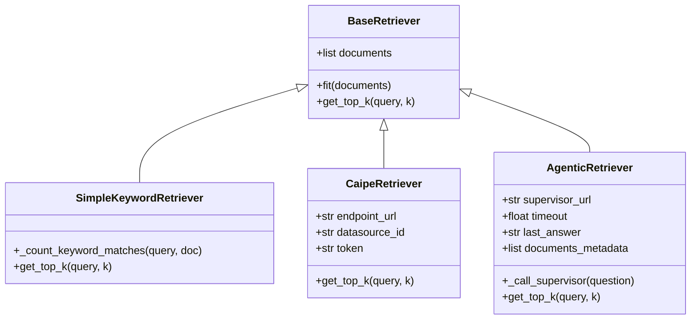
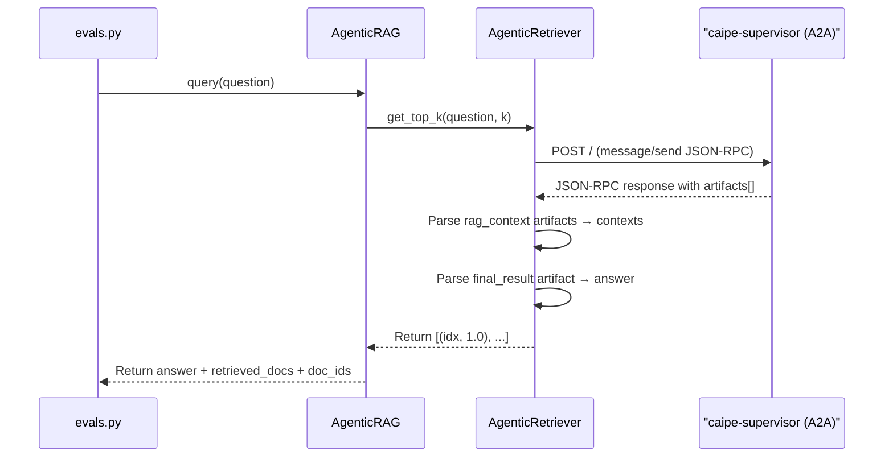

# Retrieval & Answering Integration Guide

This document explains the integration of the retrieval components with the generation (LLM/agentic answering) layer.

---

## 1. Document Retrieval Architecture

The retrieval layer isolates document search from the question-answering generation step. All retrievers inherit from `BaseRetriever` defined in [rag.py](../src/ragas_eval/rag.py).



### Retrieval Implementations
1. **`CaipeRetriever`**:
   * Queries the CAIPE knowledge base `/v1/query` endpoint with standard OIDC authentication headers.
   * Extracts and handles key metadata fields (`document_id`, `page_content`, `score`).
2. **`SimpleKeywordRetriever`**:
   * A fallback keyword-matching retriever using basic term overlap scoring.
3. **`PrecomputedRAG`** (in [precomputed_rag.py](../src/ragas_eval/precomputed_rag.py)):
   * A mock runner used to retrieve contexts live based on a reference answer, simulating a dry-run or target retrieval benchmark.
4. **`AgenticRetriever`** (in [agentic_rag.py](../src/ragas_eval/agentic_rag.py)):
   * Routes queries through `caipe-supervisor`'s A2A `message/send` JSON-RPC endpoint instead of querying `rag-server` directly.
   * Parses `rag_context` artifacts from the A2A response to extract retrieved contexts.
   * Also captures the final answer from the `final_result` artifact as a side effect.
   * Returns `(idx, 1.0)` score tuples — the agent does not expose per-chunk relevance scores.

---

## 2. LLM / Agentic Answering Layer

The generation engine receives contexts from the retriever, formats them into system prompts, and calls the configured LLM.

### Answering Orchestrator: `BaseRAG`
`BaseRAG` (defined in [rag.py](../src/ragas_eval/rag.py)) ties together the LLM client, prompt templates, and the retriever.

#### Execution flow:
1. **Query Input**: `BaseRAG.query(question)` is called.
2. **Retrieve Context**: `retrieve_documents()` is called on the retriever with the query and the parameter `k` (limit).
3. **Prompt Formatting**: Context documents are joined and inserted into the system prompt template:
   ```
   Answer the following question based on the provided documents:
   Question: {query}
   Documents:
   {context}
   Answer:
   ```
4. **LLM Completion**: Calls the LLM client (e.g. OpenAI / LiteLLM server) to generate the final answer.
5. **Telemetry Trace**: Latency, raw prompt/completion tokens, and retrieved doc IDs are recorded to a trace log file.

---

## 3. Agentic Pipeline: `AgenticRAG`

`AgenticRAG` (defined in [agentic_rag.py](../src/ragas_eval/agentic_rag.py)) collapses retrieval and generation into a **single A2A call** to `caipe-supervisor`. Use this instead of `BaseRAG` when evaluating the full agentic pipeline end-to-end.

### Key differences from `BaseRAG`

| Aspect | `BaseRAG` | `AgenticRAG` |
|---|---|---|
| Retrieval source | CAIPE `/v1/query` | `caipe-supervisor` A2A endpoint |
| Generation | Local LLM call (LiteLLM) | Agent handles generation |
| `llm_client` | Required | `None` (set to dummy) |
| Contexts source | API response directly | `rag_context` artifacts in A2A response |
| Answer source | LLM completion | `final_result` artifact in A2A response |
| Score per chunk | Real similarity score | Fixed `1.0` (not exposed by agent) |

### Execution flow



### `rag_context` artifact shapes

The A2A response contains one `rag_context` artifact per tool call. Two shapes are parsed by `_parse_rag_context_artifact()`:

**`search` tool** — dictionary with result lists:
```json
{
  "semantic_results": [
    { "text_content": "...", "metadata": { "document_id": "hotpotqa_abc123" } }
  ],
  "keyword_results": [...]
}
```

**`fetch_document` tool** — list of document objects:
```json
[
  { "document": { "page_content": "...", "document_id": "hotpotqa_abc123" } }
]
```

Both shapes produce `(content, doc_id)` tuples. Results are deduplicated by content (preserving order) and capped to `k` items.

### Prerequisite: `rag_context` patch

`AgenticRAG` requires the `rag_context` patch applied to `agent.py` in the `caipe-supervisor` deployment. Without it, the A2A response contains no `rag_context` artifacts and context metrics (`context_recall`, `retrieval_recall`, `retrieval_precision`) will score `0.0`.

The patch makes the agent yield a `rag_context` artifact whenever the `search` or `fetch_document` tools are called, embedding the raw tool output as a JSON string in the artifact's text parts.

### Factory function

```python
from ragas_eval.agentic_rag import default_agentic_rag_client

client = default_agentic_rag_client(
    supervisor_url="http://localhost:8000",  # default
    timeout=120.0,
    logdir="evals/logs",
)
result = client.query("Were Scott Derrickson and Ed Wood of the same nationality?")
# result["answer"]            — generated answer from the agent
# result["retrieved_docs"]    — list of {content, document_id, metadata}
# result["retrieved_doc_ids"] — list of doc IDs for retrieval scoring
```

### Running agentic eval

```bash
scripts/run_eval_agentic.sh
# Equivalent to:
source .venv/bin/activate
python3 -m ragas_eval.evals --limit 1 --top-k 5 --agentic
```

The `--agentic` flag switches `evals.py` to instantiate `AgenticRAG` instead of the default `BaseRAG` pipeline.
