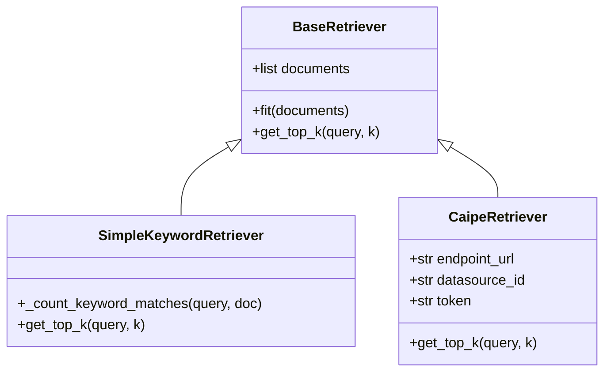

# Retrieval & Answering Integration Guide

This document explains the integration of the retrieval components with the generation (LLM/agentic answering) layer.

---

## 1. Document Retrieval Architecture

The retrieval layer isolates document search from the question-answering generation step. All retrievers inherit from `BaseRetriever` defined in [rag.py](../src/ragas_eval/rag.py).



### Retrieval Implementations
1. **`CaipeRetriever`**:
   * Queries the CAIPE knowledge base `/v1/query` endpoint with standard OIDC authentication headers.
   * Extracts and handles key metadata fields (`document_id`, `page_content`, `score`).
2. **`SimpleKeywordRetriever`**:
   * A fallback keyword-matching retriever using basic term overlap scoring.
3. **`PrecomputedRAG`** (in [precomputed_rag.py](../src/ragas_eval/precomputed_rag.py)):
   * A mock runner used to retrieve contexts live based on a reference answer, simulating a dry-run or target retrieval benchmark.

---

## 2. LLM / Agentic Answering Layer

The generation engine receives contexts from the retriever, formats them into system prompts, and calls the configured LLM.

### Answering Orchestrator: `BaseRAG`
`BaseRAG` (defined in [rag.py](../src/ragas_eval/rag.py)) ties together the LLM client, prompt templates, and the retriever.

#### Execution flow:
1. **Query Input**: `BaseRAG.query(question)` is called.
2. **Retrieve Context**: `retrieve_documents()` is called on the retriever with the query and the parameter `k` (limit).
3. **Prompt Formatting**: Context documents are joined and inserted into the system prompt template:
   ```
   Answer the following question based on the provided documents:
   Question: {query}
   Documents:
   {context}
   Answer:
   ```
4. **LLM Completion**: Calls the LLM client (e.g. OpenAI / LiteLLM server) to generate the final answer.
5. **Telemetry Trace**: Latency, raw prompt/completion tokens, and retrieved doc IDs are recorded to a trace log file.
